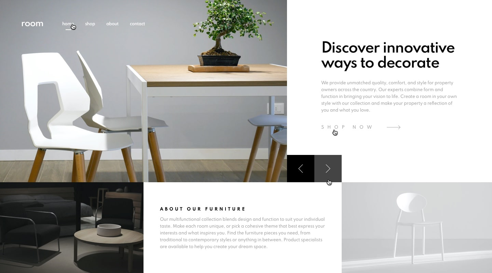

# Prueba 2

Desarrollo de sitio web con la informacion requerida segun el ingeniero de seleccion. Las dimensiones de los componentes no fueron compartidas asi que se intuira mas o menos por aproximacion

Para la solucion de este proyecto se hace uso de la siguiente libreria o plugin de tercero con javascript
> Siema: Para hacer Slides [Link de referencia](https://pawelgrzybek.github.io/siema/)

## Imagenes de referencia
> **Referencia:** Desktop Preview

> **Referencia:** Desktop Active States

> **Referencia:** Desktop Design Slides

> **Referencia:** Mobile Preview

> **Referencia:** Mobile Navigation

Se utilizaran estas imagenes de referencia para la creacion del sitio